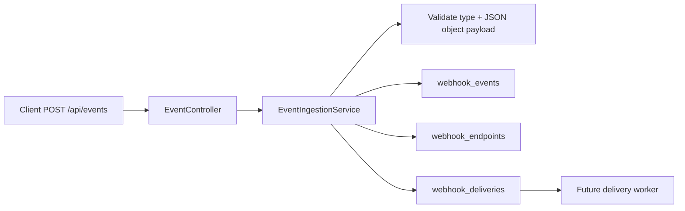

# Milestone 02: Reliable Event Ingestion

## Goal

The platform must record durable work before any webhook sending worker exists.

When a client posts one valid Event, the system must:

- persist exactly one `webhook_events` row;
- select the currently registered Endpoints;
- create one `webhook_deliveries` row per selected Endpoint;
- create every Delivery with status `PENDING`;
- commit the Event and its Deliveries atomically.

This milestone intentionally does not send outbound HTTP. Sending is a later worker concern.

## System Model



The important design decision is that `Event` and `Delivery` are separate concepts.

An Event is the business fact the platform received. A Delivery is a durable unit of work: send
that Event to one Endpoint. One Event may create many Deliveries because each registered receiver
has independent success, timeout, retry, and failure state.

## Reliability Invariants

- Invalid input creates no Event and no Delivery.
- A valid Event with zero Endpoints is still durable.
- Duplicate Endpoint URLs are not collapsed. Endpoint rows are independent subscribers.
- Event creation and Delivery creation are one database transaction.
- The database rejects duplicate `(event_id, endpoint_id)` Delivery rows.
- The Delivery table has a status-leading index for future worker polling.

## Practice Workflow

The production structure is already present, but the core behavior is intentionally incomplete.
Learn this milestone through small red-green-debug loops.

### Step 1: Event Type Rule

Run:

```bash
mvn -Dtest=EventTypeValidatorTest test
```

Implement `EventTypeValidator.isValid(...)` one test at a time. Only the first test is enabled
initially. After it passes, enable the next disabled test method in the same class.

Do not start with the final regex. First write the smallest logic that makes the current failing
case pass, then broaden it when the next case fails.

### Step 2: Delivery Planning

After the validator tests pass, enable `DeliveryPlannerTest` and run:

```bash
mvn -Dtest=DeliveryPlannerTest test
```

Your job is to explain and implement this rule:

```text
one Endpoint row -> one PENDING DeliveryPlan
```

Duplicate URLs should not be collapsed because the subscriber identity is the Endpoint row, not
the URL string.

### Step 3: Schema Review

Run:

```bash
mvn -Dtest=EventSchemaTest test
```

This should pass with the current scaffold. Read the migration and explain what each constraint
prevents:

- foreign key from Delivery to Event;
- foreign key from Delivery to Endpoint;
- unique `(event_id, endpoint_id)`;
- status-leading index.

### Step 4: Transactional Ingestion

After the domain tests pass, enable `EventApiIntegrationTest` and run:

```bash
mvn -Dtest=EventApiIntegrationTest test
```

Implement `EventIngestionServiceImpl.ingest(...)` in small slices:

1. invalid input returns 400 and writes no rows;
2. valid event with zero Endpoints writes one Event and zero Deliveries;
3. valid event with two Endpoints writes one Event and two PENDING Deliveries;
4. response `deliveryCount` matches the committed Delivery rows.

Keep `@Transactional` on the service method. If Delivery creation fails, the Event row must roll
back too.

### Available Scaffold

Main production path:

- `POST /api/events`
- `EventController`
- `EventIngestionServiceImpl`
- `EventRepository`
- `EndpointRepository`
- `DeliveryPlanner`
- `DeliveryRepository`

Persistence:

- `webhook_events`
- `webhook_deliveries`
- foreign keys from Delivery to Event and Endpoint
- unique constraint on `(event_id, endpoint_id)`
- index on `(status, created_at)`

Tests:

- `EventTypeValidatorTest`
- `DeliveryPlannerTest`
- `EventSchemaTest`
- `EventApiIntegrationTest`

Hidden regression checks still exist under `autograders/lab02`, but they are not the learning
driver. Use them after your visible tests pass.

## Debug Checklist

When event ingestion behaves incorrectly, diagnose in this order:

1. Did the request pass API validation?
   - Check HTTP status and error `code`.
   - Invalid `type` should return `INVALID_EVENT_TYPE`.
   - Invalid `payload` should return `INVALID_EVENT_PAYLOAD`.

2. Did the transaction commit?
   - Query `webhook_events`.
   - Query `webhook_deliveries`.
   - A valid event should never leave partial Delivery work.

3. Did endpoint selection match expectation?
   - Query `webhook_endpoints` before posting the Event.
   - Endpoints created after the Event should not retroactively create Deliveries.

4. Did delivery planning preserve subscriber identity?
   - Compare `webhook_deliveries.endpoint_id` with `webhook_endpoints.id`.
   - Same URL on two rows should still produce two Delivery rows.

5. Did the schema protect the invariant?
   - Try duplicate `(event_id, endpoint_id)`.
   - Try missing Event FK.
   - Try missing Endpoint FK.

## Production Questions To Practice

- Why do we write Delivery rows before sending HTTP?
- What failure happens if Event is durable but some required Deliveries are not?
- Why is outbound HTTP not inside this transaction?
- If the process crashes after commit but before sending, how does the future worker recover?
- If two workers later poll `PENDING` Deliveries, what lock or claim mechanism is needed?

## Next Milestone

Milestone 03 should introduce a delivery worker:

- poll pending Deliveries;
- claim work safely under concurrency;
- send outbound HTTP with timeout;
- record attempts;
- retry with backoff;
- expose metrics for pending, succeeded, failed, and retrying deliveries.
